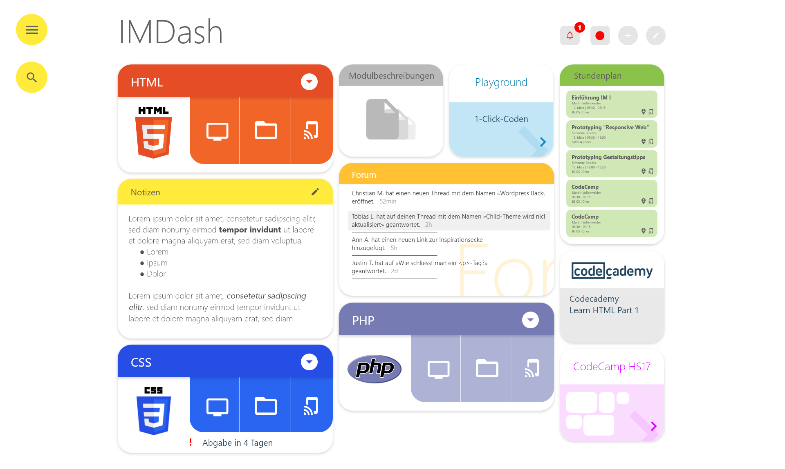
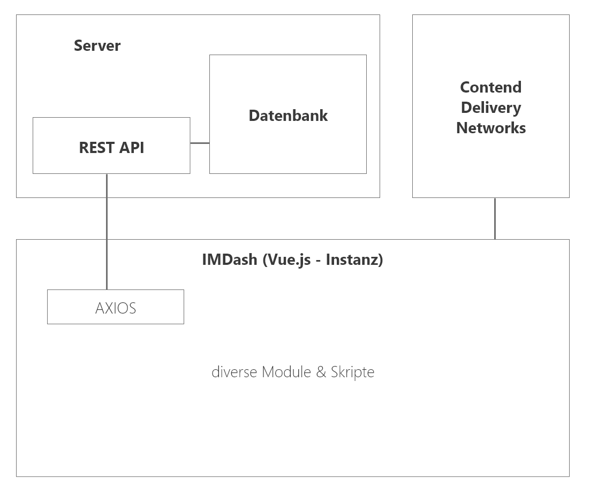

# IMDash
> Das IMDash ist eine ergänzende E-Learning Plattform zu Moodle den Unterricht der 'Interaktiven Medien' noch interaktiver zu gestalten.

**Status:**
- Prototyp

Diese Dokumentation reisst das Konzept, die technische Beschreibung, die verwendeten Technologien, die Herausforderungen und die potentielle Weiterentwicklung an. (Zugangsdaten werden per Mail verschickt)

## Rahmenbedingungen
Dieses Tool wurde während der Major-Ausbildung im Studiengang Multimedia Production (MMP) an der [HTW Chur](https://www.htwchur.ch/) entwickelt. Während dem Frühlingssemester 2018 wurde das Tool konzipiert und wird im Herbstsemester 2018 umgesetzt. Es ist ein Studentenprojekt und für beide Entwickler das erste Tool dieser Grösse.

Das Projekt hat einen insgesamten Wert von 8 ECTS von zwei Studierenden.

  

## Konzept
> Das IMDash soll eine ergänzende Plattform zu Moodle darstellen, die MMP Studierende im IM-Unterricht unterstützen soll.

**Giordi, dein Absatz ;)**

# Technische Beschreibung

Das IMDash ist eine Single Page Application (SPA) die komplett in der Laufzeit des lokalen Browsers ausgeführt wird. Die grobe Struktur sieht wiefolgt aus:

  

## Aufbau Applikation

# Technlologien
Das IMDash wurde hauptsächlich in **Javascript** mit dem Single Page Application (SPA) Framework **Vue.js** geschrieben. Die REST-API wurde in **PHP** geschrieben. Die Daten liegen auf einer **MySQL**-Datenbank.

Innerhalb der SPA wurden verschiedene Plugins & Frameworks von Drittentwickler genutzt, die allesamt Open Source sind.

Die folgende Liste sind alles Scripte, die wir in unserem Tool eingebunden haben. Gewisse Skripte haben ein riesen Potential, das wir bei weitem nicht ausgeschöpft haben. Mehr dazu im Punkt weiterentwicklung.

**JavaScript:**
- [jQuery 3.3.1](https://jquery.com/) Unsere JavaScript-Library
- [jQuery UI 1.12.1](https://jqueryui.com/) Für UI-Elemente in der Application
- [popper.js](https://popper.js.org/) Für customized ToolTips
- [packery.js](https://packery.metafizzy.co/) Die Kacheln-Anordnung für das Dashboard
- [draggabilly.js](https://draggabilly.desandro.com/) Fügt die Drag'n'Drop-Funktion hinzu
- [vue.js](https://vuejs.org/) Das SPA Framework
- [vue-router.js](https://router.vuejs.org/) Routet die unterseiten innerhalb der SPA
- [axios.js](https://github.com/axios/axios) Effizientes AJAX-Framework, optimiert für vue.js
- [vue-responsive-grid-layout.js](https://www.npmjs.com/package/vue-responsive-grid-layout) Macht das Dashboard-Layout responsive
- [bootstrap.js](https://getbootstrap.com/) Bootstrap: frontend component library
- [vue-tippy.js](https://github.com/KABBOUCHI/vue-tippy) Vue ToolTips mit vue-bind
- [vue-swatches.js](https://saintplay.github.io/vue-swatches/) Farbenwähler für Vue.js
- [vue-clickaway.js](https://www.npmjs.com/package/vue-clickaway) Fügt einen Event für den Klick ausserhalb des Elementes hinzu
- [vue-instant.browser.js](https://github.com/santiblanko/vue-instant) Benutzerdefinierti Vorschlag-Liste wie bei Google
- [sweet-modal.js](https://sweet-modal.adepto.as/) Modalfenster mit verschiedenenm Inhalt
- [vue-snotify.js](https://github.com/artemsky/vue-snotify) Notification Zentrum für Vue.js
- [vue-tabs.js](https://github.com/spatie/vue-tabs-component) Fügt Tabs zu einer Vue-App
- [vue-star-rating.js](https://jsfiddle.net/craig_h_411/992o7cq5/) Bewerten mit Sternen
- [pdf.js](https://mozilla.github.io/pdf.js/) Rendert PDF-Seiten auf Canvas

**CSS:**
- [bootstrap.css](https://getbootstrap.com/) CSS-Komponente zu Bootstrap
- [vue-animate.css](https://github.com/asika32764/vue2-animate) Animations-Library für CSS3 Animationen
- [vue-swatches.css](https://saintplay.github.io/vue-swatches/) Zugehörige CSS-Library für obiges JS-Plugin
- [vue-instant.css](https://github.com/santiblanko/vue-instant) Zugehörige CSS-Library für obiges JS-Plugin
- [vue-snotify.material.css](https://github.com/artemsky/vue-snotify) Zugehöriger CSS-Style für obiges JS-Plugin
- [sweet-modal.css](https://sweet-modal.adepto.as/) Zugehörige CSS-Library für obiges JS-Plugin
- [hamburger.css](https://jonsuh.com/hamburgers/) Hamburger-CSS-Framework für das Menu

**Fonts:**
- [Raleway](https://fonts.google.com/specimen/Raleway) Raleway als Haupfont
- [Material Icons](https://material.io/tools/icons/?style=baseline) Icon-Library für alle Symbole

**Tools:**
- [Visual Studio Code](https://code.visualstudio.com/) IDE von einem Entwickler (inkl. diverser Plugins)
- [Brackets](http://brackets.io/) IDE von einem Entwickler
- [vue-devtools](https://github.com/vuejs/vue-devtools) Dev-Tools um die Vue-Instanz zu debuggen.

### Abgesetzte Technologien
Im Verlaufe der Entwicklung haben wir unseren Code mehrfach umstellen müssen. Die Gründe waren divers, unter anderem hatten wir Technologien verwendet, die gar nicht unseren Anforderungen entsprachen. Da wir relativ neue Entwickler sind, haben wir das erst beim programmieren erkannt.

- [Code Igniter](https://www.codeigniter.com/)
-- Dieses serverseitige PHP-Framework hatten wir zu Beginn in unserem Code verbaut. Wir merkten aber, dass wenn wir z.B. die Features wie offline Verfügbarkeit oder das klassische SPA-Feeling umsetzen wollen, eine andere Technologie brauchen. Daher haben wir komplett auf JavaScript umgesattelt und mit einer einfachen REST-API gearbeitet. Die REST-API könnte man auch in Code Igniter umsetzen, war jedoch zum Zeitpunkt von diesem Entscheid die Schnittstelle so klein, als ob wir mit Keulen Mücken jagen.
- [jQuery](https://jquery.com/)
-- Dieses Framework ist oben aufgelistet und wurde auch verwendet, jedoch nur an ein paar Stellen wo es für uns keine andere Möglichkeit gab. Eigentlich darf man mit Vue.js kein jQuery verwenden, da beide Frameworks einen virtual-DOM aufbauen uns sich so gegenseitig durcheinander bringen. Da wir ohne Webpack arbeiteten, waren z.B. die sweet-modals nicht via Vue-Instanz aufrufbar, jedoch via jQuery. Ebenfalls für das Frontend haben wir ein paar jQuer Funktionen verwendet.
- [Firebase](https://firebase.google.com/)
-- Da wir am Anfang mit CodeIgniter gearbeitet haben, war eine MySQL-Datenbank viel näher. Beim Umstieg auf eine komplette SPA war der Moment schon vorbei, auf Firebase umzusteigen, da schon eine gute Datenbasis in der MySQL-Datenbank vorhanden war.

# Herausforderungen

Im verlaufe unseres Projekts gab es viele Herausforderungen, mit denen wir uns konfrontiert sahen.
- **Umfang** Wir haben beide noch  nie ein solch grosses Projekt konzipiert und programmiert. Wir erkannten schnell, dass es vor allem in der Konzeption einiges mehr beinhaltet, als ursprünglich ausgedacht.
- **Konzeption** Unser IMDash in unseren Köpfen war eine Vision. Wir hatten eine konkrete Vorstellung davon, was das Tool können muss und wie es aussehen könnte. Durch das Usertesting und der Ausarbeitung der UseCases hatte das Projekt teilweise eine andere Form bekommen. Zudem wollten wir nicht das schon vorhandene Moodle konkurrieren, denn in dieser Form wie wir es kennen ist Moodle schon gut.
- **Grösse** Beim Programmieren stiessen wir auf diverse Probleme, das das IMDash immer grösser wurde.
    - **State Management** Das fast grösste Problem an der jetztigen Version ist das State-Management der Applikation. Vue ist sehr modular und wir programmierten für jede Funktion ein (mehrere) Module. Das Problem dabei ist, dass jedes Modul in ihrer jeweiligen Instanz eigene States besitzt. Vue.js würde mit Vuex eigentlich einen globalen State-Store anbieten, jedoch war es zum Zeitpunkt dieser Erkenntniss schon zu spät, das noch umzubauen. Denn die Applikation müsste man grundsätzlich neu strukturieren.
    - **Package Management** Wir haben die Applikation mit einer globalen Vue.js-Instanz programmiert und alle neuen Module global installiert. Vor allem für die Performance ist das gar nicht gut, denn so braucht der Browser viel zu viele Ressourcen. Auf mobilen Geräten wäre der Akku da ein Problem.
    - **API** Die API wuchs auch immer weiter. Wir begannen für jeden Fall, der die API braucht, ein separates Script zu schreiben. Mit einem Integer "mode" übergaben wir die Anforderung. Schöner wäre es, könnte man die Abfrage mit einem Authenticaiton-Key sicher machen und so konfigurieren, dass man immer rohe Daten für die anschliessende Bearbeitung erhält.
    - **Axios** Axios war unser Framework für die asynchrone Abfrage aller Daten. Wir mussten leider relativ viel Abfragen machen, da wir wie oben beschrieben keinen golbalen State-Store hatten. anstatt die Werte via `$emit` zu übertragen schickten wir der Einfachheit halber nochmals einen Request.
- **CSS** Wir bauten für uns mehrere kleine Librarys für divere Stylefunktionen (Modalfenster, Kacheln, ...). Diese hatten wir mit zu wenig system konzipiert, denn am Schluss mussten wir diverse Workarounds bauen, damit diese sich nicht in die quere kamen. Ein Klassen-Prefix und nach dem System von BEM hätte uns viel Zeit erspart.
- **Falsche Technologien** Dieser Punkt wurde im Kapitel "Abgesetzte Technologien" thematisiert. Das Problem dabei war, dass wir uns für Technologien entschieden, denen wir falsche Fähigkeiten zugetraut haben oder für gewisse Features die falschen waren.
- **PDF.js** Diese Library wurde von Mozilla entwickelt und ist Open Source. Diese Render-Engine wird auch im Browser "Firefox" verwendet, um PDFs anzuzeigen. Leider ist sie aber sehr, sehr umfangreich und kann sehr viele Funktionen. Daher mussten wir die Engine so nutzen, damit wir in Vue unsere PDF-Seiten anzeigen können. Wir mussten diese Nutzen, da z.B. Links innerhalb des PDFs von anderen Engines gar nicht erkannt werden. Doch einen PDF-Viewer zu progrmmieren ist fast schon ein eigenes Semesterprojekt.

# Potentielle Weiterentwicklung

Wir glauben, dass das IMDash eine Zukunft haben könnte. Doch sicher nicht in dieser Form wie wir sie Programmiert haben, denn sonst wird es eine Katastrophe. Aus unseren Learnings denken wir, könnte man eine coole, sinnvolle Plattform für den IM-Unterricht produzieren. Die Gefahr dabei ist aber ganz klar, dass es dem Moodle eine Konkurrenz macht. Ebenso aus Sicht für den Studierende ist es nicht viel besser, einfach nochmals eine weitere Plattform nutzen zu müssen. Eine Lösung dazu könnte sein, dass das IMDash zu einem Moodle-Theme umfunktioniert wird und somit einen Teil von Moodle wird (Sowie auch die Funktionalitäten der Prüfungen usw. eingepflegt wurden).
Eines steht fest, die Entwicklung "von scratch" ist wahrscheinlich nicht sehr wirtschaftlich. Auch angesichts der Konkurrenz zu bestehenden Produkten. Aber mit dieser Idee eine Integration z.B. in Moodle zu machen könnte aus unserer Sicht eine Zukunft sein.

### Dev-Tools
Für die Entwicklung mit Vue.js haben wir die Vue Devtools verwendet. Die Electron-App kann mit ``npm install -g @vue/devtools`` installiert und mit dem Kommando ``vue-devtools`` ausgeführt werden.
