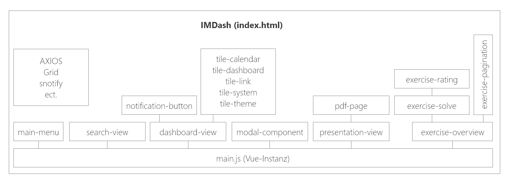

# IMDash
> Das IMDash ist eine ergänzende E-Learning Plattform zu Moodle, welche den Unterricht der 'Interaktiven Medien' noch interaktiver gestalten soll.

**Status:**
- Prototyp

[Demo](http://862341-7.web1.fh-htwchur.ch/vue/index.html)

Diese Dokumentation reisst das Konzept, die technische Beschreibung, die verwendeten Technologien, die Herausforderungen und die potentielle Weiterentwicklung an. (Zugangsdaten werden per Mail verschickt)

## Rahmenbedingungen
Dieses Tool wurde während der Major-Ausbildung im Studiengang Multimedia Production (MMP) an der [HTW Chur](https://www.htwchur.ch/) entwickelt. Während dem Frühlingssemester 2018 wurde das Tool konzipiert und wird im Herbstsemester 2018 umgesetzt. Es ist ein Studentenprojekt und für beide Entwickler das erste Tool dieser Grösse.

Das Projekt hat einen insgesamten Wert von 8 ECTS von zwei Studierenden.

  

## Konzept
> Das IMDash ist eine E-Learningplattform für MMP-Studierende, auf welcher alle Informationen, Übungen und Scripte zum Modul «Interaktive Medien» zu finden sind.

Die HTW Chur verwendet Moodle als ihr Kursmanagementsystem über welches die Studierenden die Unterrichtsunterlagen beziehen können. Für ein Modul bei welchem lediglich einige wenige PDF’s abgelegt werden müssen, eignet sich Moodle ideal. Für ein Grundmodul wie «Interaktive Medien», bei welchem sich jedes Semester eine Vielzahl an Dateien und Dateitypen ansammelt, ist die Plattform allerdings weniger geeignet. Das IMDash soll eine ergänzende Plattform zu Moodle darstellen, die MMP Studierende im IM-Unterricht unterstützen soll. Moodle ist lediglich eine Distributionsplattform ohne interaktive Elemente.
Das IMDash soll dieses Problem lösen, indem sich die Funktionen ausschliesslich den Bedürfnissen des Moduls Interaktive Medien anpassen. Kern des IMDashs ist die Darstellung in Form eines Dashboards, welches von jedem User an die eigenen Wünsche individuell angepasst werden kann.

# Technische Beschreibung

Das IMDash ist eine Single Page Application (SPA) die komplett in der Laufzeit des lokalen Browsers ausgeführt wird. Die grobe Struktur sieht wie folgt aus:

  

## Aufbau Applikation
In Vue.js wird mit Komponenten Code modularisiert. Um einen Überblick zu haben, wie die einzelnen Komponenten aufeinander aufbauen, haben wir das in einer Grafik visualisiert:

  

## Komponenten
Auf die wichtigsten Komponenten gehen wir hier kurz ein.

### Dashboard
Diese Komponente hat mehrere Funktionen (was wir im Nachhinein gerne verhindert hätten.):
- Dashboard-Frame anzeigen
- Kacheln hinzufügen
- Responsive Grid anzeigen
- Kachel einbinden

Beim Aufruf werden verschiedenste Abfragen zum Server gestartet: Es wird das aktuelle Layout, die einzelnen Kacheln für das Dashboard und alle Daten für das Hinzufügen einer Kachel (also alle möglichen Kacheln) geladen. Anschliessend wird das Raster initialisiert, sobald alle Abfragen zurückgekommen sind (mit einem Watcher). Sobald das Flag gesetzt wird, wird der ganze Inhalt gerendert.

> Das Modalfenster wird global geladen und nicht beim Dashboard-Aufruf. Es ist theoretisch auf jeder Seite aufrufbar.

Diese Komponente verfügt noch über weitere Funktionen wie das neu Anordnen der Kacheln und das Hinzufügen/Löschen.

### Menu
Das Menu hat im Verlaufe der Zeit das State-Management für das aktuelle Dashboard übernommen. Da diese Komponente nur bei einem Hard-Refresh neu aufbaut war sie dafür geeignet. Natürlich würde eine solche Funktionalität in den globalen Store gehören.

Das Menu beinhaltet nebst den verschiedenen Dashboards auch Links zu den weiteren ausprogrammierten Bereichen des IMDash. Es soll schlussendlich der Dreh- und Angelpunkt im System werden.

### Presenation (PDF)
Die grösste Komponente ist die Präsentationsansicht. Zuerst wird auch anhand der ID, welche als Parameter via URL übergeben wird, die Präsentation von der API geladen. Anschliessend wird das PDF-Dokument Seite für Seite gerendert. Die PDF.js Library ist vollständig [Promise-based](https://developer.mozilla.org/de/docs/Web/JavaScript/Reference/Global_Objects/Promise), weshalb das alles asynchron abläuft. Beim rendern der PDF-Seiten wird zuerst für jede Seite ein Canvas mit fixer Breite erstellt. Anschliessen für jede Seite einen Promise abgesetzt, der aus dem PDF ein Bild bzw. eine Canvas-Oberfläche rechnet. Als Abschluss wird diese Seite dem richtigen Canvas zugewiesen.

Diese Komponente beinhaltet auch das eintragen von Notizten. Das Prinzip ist sipel: Auf einen Klick auf das etwas dunklere Feld wird ein Textfeld angezeigt. Man kann beliebig hineinschreiben. Mit `Shift + Enter` kann man eine neue Zeile einfügen. Mit nur `Enter` wird das Textfeld entfernt und der beinhaltende Text als Paragraph in der Notizenspalte angezeigt. Zeitgleich wird ein Promise abgesetzt, der die Notiz in der Datenbank einträgt. 

Nebst dem einfachen Eintragen ist es auch möglich, verschiedene Notizensätze anzuzeigen. Mit einem Klick auf den Sharing-Button öffnet sich ein Fenster (realisiert mit dem Framework [vue-tippy.js](https://github.com/KABBOUCHI/vue-tippy)), in dem man alle freigegebenen Notizensätze sieht.

In diesem Sharing-Fenster ist es auch möglich, Notizensätze anderen Studierenden freizugeben. Mit einem Klick auf `Senden` wird ein Suchfeld geöffnet, in dem man den Name von gegenüber einträgt. Dieses Suchfeld schlägt bei der ersten Eingabe mögliche Namen vor, an die man den Notizensatz senden könnte. Somit muss man nicht mit E-Mail-Adressen arbeiten. Nach einem Enter wird derjenigen Person der Satz freigegeben.

### Übungen
Bei den Übungen haben wir etwas mehr mit der Modularisierung gearbeitet, jedoch ist auch dies noch ausbaufähig. Eine Sicht ist es, alle Übungen zu sehen (beinhaltet noch die "Pagination"-Komponente), eine andere ist es die Übungen zu lösen und die letzte die Übung zu bewerten.

Die Übungsübersicht lädt einfach alle Übungen vom Server die es zu lösen gibt. Zudem wird bei der Initialisierung jeder Übung eine Kategorie und somit auch eine Farbe zugeordnet. In dieser Übersicht gibt es auch eine "Empfohlen"-Sektion, in der drei Übungen vorgeschlagen werden, die für den jeweiligen User gerade aktuell wären. Jedoch haben wir keine solche Form der Artificial Intelligence eingebaut, sondern einfach eine zufällige Abfrage.

Beim Übungen lösen wird zu beginn dass erwartete Resultat angzeigt. Ebenfalls wird eine Übungsbeschreibung geliefert. Hat man die Übung verstanden kann man sie versuchen zu lösen. Dadruch öffnet sich ein Modalfenster und darin ist einen Pen von Codepen.io. Wenn man die Übung abgeschlossen hat, wird der Code von Codepen heruntergeladen und in der IMDash-Datenbank gespeichert.

Nach dem Abschluss der Übung wird der User zur Bewertung weitergeleitet, wo er für die Schwierigkeit ein Rating abgeben kann.

## Semantische Programmierung
Während der Programmierung versuchten wir, möglichst eindeutige und verständliche Variabel- und Funktionsnamen zu verwenden. Wo nötig haben wir auch den Code kommentiert.

### Dev-Tools
Für die Entwicklung mit Vue.js haben wir die Vue Devtools verwendet. Die Electron-App kann mit ``npm install -g @vue/devtools`` installiert und mit dem Kommando ``vue-devtools`` ausgeführt werden.

# Technlologien
Das IMDash wurde hauptsächlich in **Javascript** mit dem Single Page Application (SPA) Framework **Vue.js** geschrieben. Die REST-API wurde in **PHP** geschrieben. Die Daten liegen auf einer **MySQL**-Datenbank.

Innerhalb der SPA wurden verschiedene Plugins & Frameworks von Drittentwickler genutzt, die allesamt Open Source sind.

Die folgende Liste sind alles Scripte, die wir in unserem Tool eingebunden haben. Gewisse Skripte haben ein riesen Potential, das wir bei weitem nicht ausgeschöpft haben. Mehr dazu im Punkt weiterentwicklung.

**JavaScript:**
- [jQuery 3.3.1](https://jquery.com/) Unsere JavaScript-Library
- [jQuery UI 1.12.1](https://jqueryui.com/) Für UI-Elemente in der Application
- [popper.js](https://popper.js.org/) Für customized ToolTips
- [packery.js](https://packery.metafizzy.co/) Die Kacheln-Anordnung für das Dashboard
- [draggabilly.js](https://draggabilly.desandro.com/) Fügt die Drag'n'Drop-Funktion hinzu
- [vue.js](https://vuejs.org/) Das SPA Framework
- [vue-router.js](https://router.vuejs.org/) Routet die unterseiten innerhalb der SPA
- [axios.js](https://github.com/axios/axios) Effizientes AJAX-Framework, optimiert für vue.js
- [vue-responsive-grid-layout.js](https://www.npmjs.com/package/vue-responsive-grid-layout) Macht das Dashboard-Layout responsive
- [bootstrap.js](https://getbootstrap.com/) Bootstrap: frontend component library
- [vue-tippy.js](https://github.com/KABBOUCHI/vue-tippy) Vue ToolTips mit vue-bind
- [vue-swatches.js](https://saintplay.github.io/vue-swatches/) Farbenwähler für Vue.js
- [vue-clickaway.js](https://www.npmjs.com/package/vue-clickaway) Fügt einen Event für den Klick ausserhalb des Elementes hinzu
- [vue-instant.browser.js](https://github.com/santiblanko/vue-instant) Benutzerdefinierti Vorschlag-Liste wie bei Google
- [sweet-modal.js](https://sweet-modal.adepto.as/) Modalfenster mit verschiedenenm Inhalt
- [vue-snotify.js](https://github.com/artemsky/vue-snotify) Notification Zentrum für Vue.js
- [vue-tabs.js](https://github.com/spatie/vue-tabs-component) Fügt Tabs zu einer Vue-App
- [vue-star-rating.js](https://jsfiddle.net/craig_h_411/992o7cq5/) Bewerten mit Sternen
- [pdf.js](https://mozilla.github.io/pdf.js/) Rendert PDF-Seiten auf Canvas

**CSS:**
- [bootstrap.css](https://getbootstrap.com/) CSS-Komponente zu Bootstrap
- [vue-animate.css](https://github.com/asika32764/vue2-animate) Animations-Library für CSS3 Animationen
- [vue-swatches.css](https://saintplay.github.io/vue-swatches/) Zugehörige CSS-Library für obiges JS-Plugin
- [vue-instant.css](https://github.com/santiblanko/vue-instant) Zugehörige CSS-Library für obiges JS-Plugin
- [vue-snotify.material.css](https://github.com/artemsky/vue-snotify) Zugehöriger CSS-Style für obiges JS-Plugin
- [sweet-modal.css](https://sweet-modal.adepto.as/) Zugehörige CSS-Library für obiges JS-Plugin
- [hamburger.css](https://jonsuh.com/hamburgers/) Hamburger-CSS-Framework für das Menu

**Fonts:**
- [Raleway](https://fonts.google.com/specimen/Raleway) Raleway als Haupfont
- [Material Icons](https://material.io/tools/icons/?style=baseline) Icon-Library für alle Symbole

**Tools:**
- [Visual Studio Code](https://code.visualstudio.com/) IDE von einem Entwickler (inkl. diverser Plugins)
- [Brackets](http://brackets.io/) IDE von einem Entwickler
- [vue-devtools](https://github.com/vuejs/vue-devtools) Dev-Tools um die Vue-Instanz zu debuggen.

### Abgesetzte Technologien
Im Verlaufe der Entwicklung haben wir unseren Code mehrfach umstellen müssen. Die Gründe waren divers, unter anderem hatten wir Technologien verwendet, die gar nicht unseren Anforderungen entsprachen. Da wir relativ neue Entwickler sind, haben wir das erst beim programmieren erkannt.

- [Code Igniter](https://www.codeigniter.com/)
-- Dieses serverseitige PHP-Framework hatten wir zu Beginn in unserem Code verbaut. Wir merkten aber, dass wenn wir z.B. die Features wie offline Verfügbarkeit oder das klassische SPA-Feeling umsetzen wollen, eine andere Technologie brauchen. Daher haben wir komplett auf JavaScript umgesattelt und mit einer einfachen REST-API gearbeitet. Die REST-API könnte man auch in Code Igniter umsetzen, war jedoch zum Zeitpunkt von diesem Entscheid die Schnittstelle so klein, als ob wir mit Keulen Mücken jagen.
- [jQuery](https://jquery.com/)
-- Dieses Framework ist oben aufgelistet und wurde auch verwendet, jedoch nur an ein paar Stellen wo es für uns keine andere Möglichkeit gab. Eigentlich darf man mit Vue.js kein jQuery verwenden, da beide Frameworks einen virtual-DOM aufbauen uns sich so gegenseitig durcheinander bringen. Da wir ohne Webpack arbeiteten, waren z.B. die sweet-modals nicht via Vue-Instanz aufrufbar, jedoch via jQuery. Ebenfalls für das Frontend haben wir ein paar jQuer Funktionen verwendet.
- [Firebase](https://firebase.google.com/)
-- Da wir am Anfang mit CodeIgniter gearbeitet haben, war eine MySQL-Datenbank viel näher. Beim Umstieg auf eine komplette SPA war der Moment schon vorbei, auf Firebase umzusteigen, da schon eine gute Datenbasis in der MySQL-Datenbank vorhanden war.
- [interact.js](http://interactjs.io/)
-- Zuerst wollten wir mit interact.js die Kachelanordnung selber machen. Jedoch merkten wir schnell, dass eine Kollisionserkennung sowie das ganze Drag'n'Drop (auch im Bezug auf Mobile-friendlyness) nicht einfach war. Kurz vor dem Aufgeben haben wir dann aber auf Open Source-Grid-Systeme zurückgegriffen ;) .
- [vue-codemirror.js](https://github.com/surmon-china/vue-codemirror)
-- Das IMDash wurde so konzipiert, dass darin direkt Code-Übungen gelöst werden können. Dies haben wir zu Beginn (nach langer Recherche welche Technologie die Beste ist) mit dem vue-codemirror.js lösen wollen. Doch nach anfänglicher Implementierung wurde uns bald klar, dass es sehr kompliziert wird, diesen Code auszuführen. Das wäre ein eigenes Semesterprojekt, denn JavaScript innerhalb von JavaScript auszuführen ist nicht ganz ohne. Wir entschieden uns schlussendlich für die relativ offene API von [codepen.io](https://codepen.io/#).

# Herausforderungen

Im verlaufe unseres Projekts gab es viele Herausforderungen, mit denen wir uns konfrontiert sahen.
- **Umfang** Wir haben beide noch  nie ein solch grosses Projekt konzipiert und programmiert. Wir erkannten schnell, dass es vor allem in der Konzeption einiges mehr beinhaltet, als ursprünglich ausgedacht.
- **Konzeption** Unser IMDash in unseren Köpfen war eine Vision. Wir hatten eine konkrete Vorstellung davon, was das Tool können muss und wie es aussehen könnte. Durch das Usertesting und der Ausarbeitung der UseCases hatte das Projekt teilweise eine andere Form bekommen. Zudem wollten wir nicht das schon vorhandene Moodle konkurrieren, denn in dieser Form wie wir es kennen ist Moodle schon gut.
- **Grösse** Beim Programmieren stiessen wir auf diverse Probleme, das das IMDash immer grösser wurde.
    - **State Management** Das fast grösste Problem an der jetztigen Version ist das State-Management der Applikation. Vue ist sehr modular und wir programmierten für jede Funktion ein (mehrere) Module. Das Problem dabei ist, dass jedes Modul in ihrer jeweiligen Instanz eigene States besitzt. Vue.js würde mit Vuex eigentlich einen globalen State-Store anbieten, jedoch war es zum Zeitpunkt dieser Erkenntniss schon zu spät, das noch umzubauen. Denn die Applikation müsste man grundsätzlich neu strukturieren.
    - **Package Management** Wir haben die Applikation mit einer globalen Vue.js-Instanz programmiert und alle neuen Module global installiert. Vor allem für die Performance ist das gar nicht gut, denn so braucht der Browser viel zu viele Ressourcen. Auf mobilen Geräten wäre der Akku da ein Problem.
    - **API** Die API wuchs auch immer weiter. Wir begannen für jeden Fall, der die API braucht, ein separates Script zu schreiben. Mit einem Integer "mode" übergaben wir die Anforderung. Schöner wäre es, könnte man die Abfrage mit einem Authenticaiton-Key sicher machen und so konfigurieren, dass man immer rohe Daten für die anschliessende Bearbeitung erhält.
    - **Axios** Axios war unser Framework für die asynchrone Abfrage aller Daten. Wir mussten leider relativ viel Abfragen machen, da wir wie oben beschrieben keinen golbalen State-Store hatten. anstatt die Werte via `$emit` zu übertragen schickten wir der Einfachheit halber nochmals einen Request.
- **CSS** Wir bauten für uns mehrere kleine Librarys für divere Stylefunktionen (Modalfenster, Kacheln, ...). Diese hatten wir mit zu wenig system konzipiert, denn am Schluss mussten wir diverse Workarounds bauen, damit diese sich nicht in die quere kamen. Ein Klassen-Prefix und nach dem System von BEM hätte uns viel Zeit erspart.
- **Falsche Technologien** Dieser Punkt wurde im Kapitel "Abgesetzte Technologien" thematisiert. Das Problem dabei war, dass wir uns für Technologien entschieden, denen wir falsche Fähigkeiten zugetraut haben oder für gewisse Features die falschen waren.
- **PDF.js** Diese Library wurde von Mozilla entwickelt und ist Open Source. Diese Render-Engine wird auch im Browser "Firefox" verwendet, um PDFs anzuzeigen. Leider ist sie aber sehr, sehr umfangreich und kann sehr viele Funktionen. Daher mussten wir die Engine so nutzen, damit wir in Vue unsere PDF-Seiten anzeigen können. Wir mussten diese Nutzen, da z.B. Links innerhalb des PDFs von anderen Engines gar nicht erkannt werden. Doch einen PDF-Viewer zu progrmmieren ist fast schon ein eigenes Semesterprojekt.
- **Komponenten** Die ganze komponentenbasierte Arbeitsweise und Denken kannten wir bis anhin nicht. Darum sind unsere Komponenten auch viel zu gross. Wir haben teilweise viel zu viel Code in eine Komponente verpackt. Es hätte eine viel klarere Struktur gegeben, wenn wir mehr Komponenten gemacht hätten, diese in Unterordner verschachtelt und mit einem Paket-Manager (webpack) eingebunden hätten.

# Potentielle Weiterentwicklung

Wir glauben, dass das IMDash eine Zukunft haben könnte. Doch sicher nicht in dieser Form wie wir sie Programmiert haben, denn sonst wird es eine Katastrophe. Aus unseren Learnings denken wir, könnte man eine coole, sinnvolle Plattform für den IM-Unterricht produzieren. Die Gefahr dabei ist aber ganz klar, dass es dem Moodle eine Konkurrenz macht. Ebenso aus Sicht für den Studierende ist es nicht viel besser, einfach nochmals eine weitere Plattform nutzen zu müssen. Eine Lösung dazu könnte sein, dass das IMDash zu einem Moodle-Theme umfunktioniert wird und somit einen Teil von Moodle wird (Sowie auch die Funktionalitäten der Prüfungen usw. eingepflegt wurden).
Eines steht fest, die Entwicklung "von scratch" ist wahrscheinlich nicht sehr wirtschaftlich. Auch angesichts der Konkurrenz zu bestehenden Produkten. Aber mit dieser Idee eine Integration z.B. in Moodle zu machen, könnte aus unserer Sicht eine Zukunft sein.